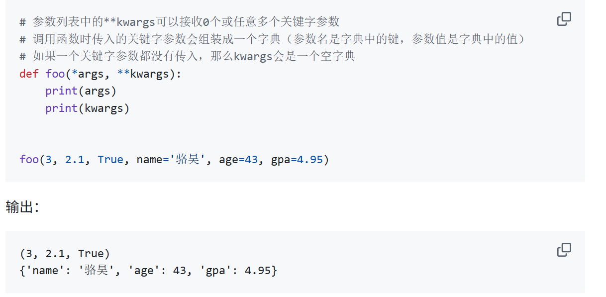
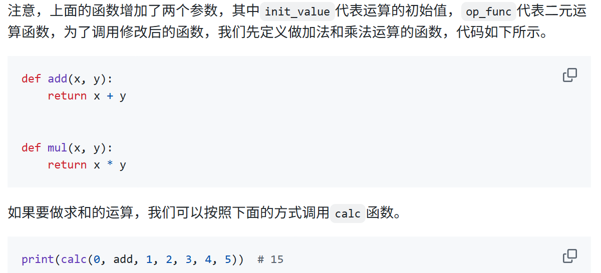

**今日学习到 17，明日从 18 开始。

# 字典
```python
xinhua = {
    '麓': '山脚下',
    '路': '道，往来通行的地方；方面，地区：南～货，外～货；种类：他俩是一～人',
    '蕗': '甘草的别名',
    '潞': '潞水，水名，即今山西省的浊漳河；潞江，水名，即云南省的怒江'
}
print(xinhua)
person = {
    'name': '王大锤',
    'age': 55,
    'height': 168,
    'weight': 60,
    'addr': '成都市武侯区科华北路62号1栋101', 
    'tel': '13122334455',
    'emergence contact': '13800998877'
}
print(person)
```
# 函数
```
* 给你组成 tuple，然后 ** 给你组成 dictionary
```


一个函数名字，更像是一个存地址的地方，你更改它存的地址。



